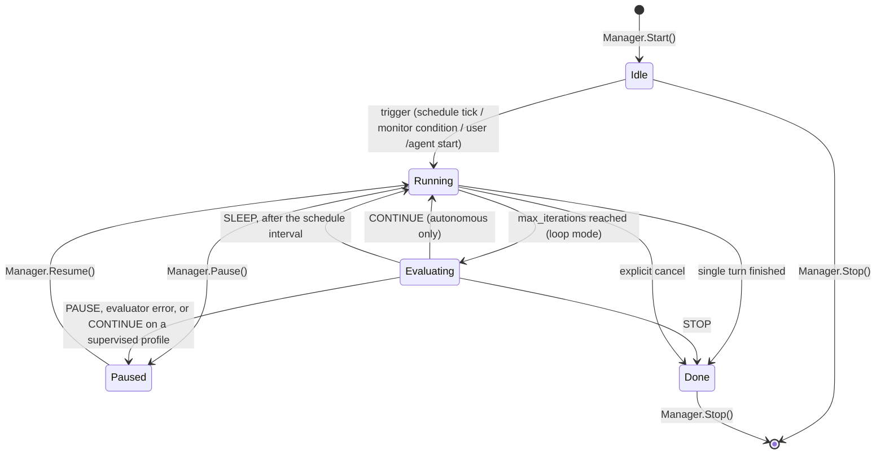
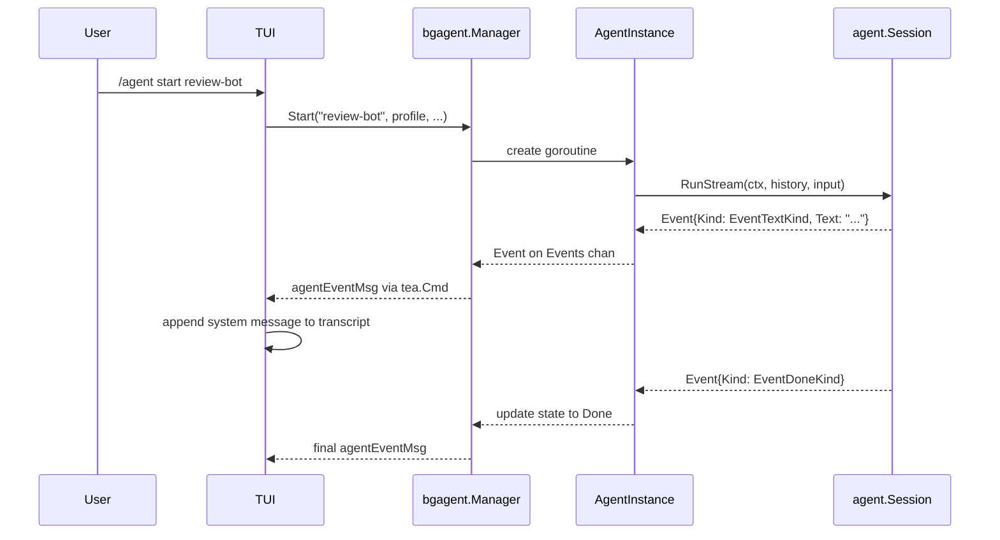

# Agent Profiles

Agent profiles are named, reusable agent definitions stored on disk under
`~/.vulnetix/belai/profiles/agents/`. They are richer than the flat prompt
profiles used by `/profile`: each profile defines a system prompt, a tool
allow-list, an operating mode, and an autonomy level.

The directory is `agentprofile.Dir()` — `config.GlobalDir()/profiles/agents`,
where `GlobalDir()` honours `BELAI_HOME` and otherwise resolves to
`~/.vulnetix/belai`.

## Profile schema

```json
{
  "name": "review-bot",
  "description": "Reviews open PRs for style issues",
  "system_prompt": "You are a code-review bot...",
  "tools": ["Read", "Bash", "Grep"],
  "mode": "loop",
  "schedule": "0 9 * * MON",
  "monitor_condition": "git status shows uncommitted changes",
  "reflection": true,
  "max_iterations": 5,
  "autonomy": "supervised",
  "provider": "llama-server",
  "model": "default",
  "effort": "low",
  "guardrails": true,
  "ask_permission": false
}
```

### Fields

| Field | Required | Type | Description |
| ----- | -------- | ---- | ----------- |
| `name` | Yes | string | Unique identifier, used with `/agent start <name>`. |
| *(file name)* | No | string | The on-disk filename (e.g. `triage-deps.json`), independent of `name`. It is never serialised — the file's own name is the record. Empty means derive it from `name`. The editor exposes it as its own field; renaming via `name` moves the file only while the file name is still derived. |
| `description` | Yes | string | Human-readable purpose, shown in `/agent list`. |
| `system_prompt` | Yes | string | The system prompt sent to the model on every turn. |
| `tools` | No | string[] | Allowed tool names; empty means the full default registry. Validated against the built-in set: `AskUserQuestion`, `Bash`, `Cd`, `Edit`, `ExitPlanMode`, `Glob`, `Grep`, `Read`, `ReadSession`, `SearchMemory`, `SearchSessions`, `Skill`, `SkillDraft`, `SubAgentLog`, `Task`, `update_plan`, `WebFetch`, `WebSearch`, `Write`; the tools a session adds when available: `KanbanSearch`, `KanbanUpdate`, `KanbanMove`, `KanbanAdd`, `KanbanHandoff`, `Vulnetix`, `ToolSearch`, `ProcessRestart`, `BashOutput`, `KillShell`, `ProcessList`, `Screenshot`, `Repos`, `RepoFiles`, `RepoRead`, `GH`, `Glab`; and MCP tools as `mcp__<server>__<tool>` (the tool part may be `*`). |
| `mode` | Yes | string | One of `single`, `loop`, `scheduled`, `monitor`, `worker`. A `worker` claims kanban items; see [Worker profiles](#worker-profiles). |
| `schedule` | No | string | Cron-like schedule expression (used when `mode` is `scheduled`). |
| `monitor_condition` | No | string | Human-readable trigger condition (used when `mode` is `monitor`). |
| `reflection` | No | bool | When true, the model is asked to emit `<thinking>` or a `reflection` field before acting. |
| `max_iterations` | No | int | Per-run iteration bound; defaults to the global `resilience.max_iterations` setting (40). |
| `autonomy` | No | string | `supervised` (default) or `autonomous`. Both execute tools during a turn; the field decides only what happens when a `loop`-mode agent exhausts `max_iterations` and the evaluator returns `CONTINUE`. An autonomous profile resets the budget and continues; a supervised one is paused instead, so unattended unbounded tool use needs the explicit opt-in. |
| `provider` | No | string | Model provider to use for this agent. Must be a built-in provider name or a configured custom-provider name. Omitted means inherit the session provider. A profile may only *name* a provider; it may never define one (no API key exfiltration). |
| `model` | No | string | Model id to use for this agent. Applies to `provider` when set, otherwise to the session provider. Omitted means inherit the session/model default (`run.DefaultModel`). |
| `effort` | No | string | Reasoning-effort hint: one of `low`, `medium`, `high`, `none`. Ignored by providers that do not support effort. Omitted means inherit the session setting. |
| `guardrails` | No | bool | When set, overrides the guardrails switch for this agent. `true` enforces the default posture; `false` ignores every gate. Omitted means inherit `settings.guardrails`. |
| `ask_permission` | No | bool | When set, overrides the permission-ask gate for this agent. `true` asks before mutating; `false` treats every permission decision as allow. Omitted means inherit `settings.ask_permission`. |

### Validation rules

- `name` must be non-empty and filesystem-safe (`[a-zA-Z0-9._-]+`).
- A non-empty file name must be a safe basename: non-empty, ending in `.json`, with no path separators, and with a stem unchanged by the name sanitiser. It may not collide with a built-in's on-disk file name.
- `mode` must be one of the five known values.
- Every entry in `tools` must exist in the default tool registry.
- `autonomy` must be `supervised` or `autonomous`.
- `schedule` is required when `mode` is `scheduled`; ignored otherwise.
- `monitor_condition` is required when `mode` is `monitor`; ignored otherwise.
- `effort` must be one of `low`, `medium`, `high`, `none` when set.
- `provider` must be a built-in provider name or a valid custom-provider name when set; profiles may *name* providers but never define them.
- A profile that sets `guardrails: false`, `autonomy: autonomous`, a looping mode (`loop`, `scheduled`, `monitor`), and omits `max_iterations` is rejected. Unattended, unbounded, and unguarded is three relaxations stacked, which is too many for a single definition.

## Background agent lifecycle



`Manager` exposes exactly `Start`, `Stop`, `Pause`, `Resume`, `List`, and
`Lookup`. There is no reset: a finished agent is stopped and started again.

### State descriptions

| State | Meaning |
| ----- | ------- |
| `Idle` | Agent is loaded but not executing; waiting for a trigger. |
| `Running` | Agent turn(s) are active in a goroutine. |
| `Paused` | Agent was running and is temporarily suspended. Its goroutine is alive and blocked; its events channel stays open. |
| `Done` | Agent completed its work (loop evaluator `STOP`, single turn finished, or cancel). |

`Pause` is only valid from `Running` and `Resume` only from `Paused`; either
call on an agent in the wrong state returns an error rather than changing it.
The loop observes the state at its next boundary and blocks on a per-instance
buffered resume channel, so `Pause` never waits for the model and `Resume`
never blocks the UI. A spurious wake is harmless: the loop re-checks the state
after waking.

A paused agent is deliberately **not** marked `Done` when its goroutine's
deferred cleanup runs — closing its events channel would make `Resume`
impossible. Only a natural exit or an explicit stop marks it done.

### Loop mode and the agent evaluator

`loop` mode is not bounded by `max_iterations`; that value is the *inner*
budget. When the inner budget is exhausted, the agent-loop evaluator is asked
what to do next (see [role-manager.md](role-manager.md), "Agent-loop
evaluator"): `CONTINUE` resets the inner budget, `SLEEP` waits one `schedule`
interval and resets it, `PAUSE` suspends until `/agent resume`, and `STOP`
ends the loop.

Two safeguards bound this:

- A **supervised** profile that receives `CONTINUE` is paused instead.
  Unattended unbounded tool use is what `supervised` exists to prevent, so a
  classifier can never grant autonomy the profile was not given.
- A malformed or unreachable evaluator fails closed to `PAUSE` — stop spending
  tokens, wait for the user.

### Reflection

When `reflection` is true, every loop turn's prompt is prefixed with an
instruction to emit a `<thinking>` block before acting, so the agent's
reasoning is visible in the transcript ahead of any tool call.

### Per-turn output isolation

`lastOutput` is reset before each turn, not only assigned on success. A turn
ending in an error event never reaches the assignment, so without the reset the
previous turn's reply would be carried forward and appended to `History` a
second time. A bounded loop hid that; a restarting one compounds it every pass.

### TUI commands

| Command | Effect |
| ------- | ------ |
| `/agent` | Open the agent picker to choose a profile for agent-mode turns |
| `/agent create <name>` | Design and save a new agent profile named `<name>`; the builder runs visibly behind an activity row and a composer phase |
| `/agent edit <name>` | Open an existing profile in the agent editor |
| `/agent list` | Show every discovered profile, its file path, and any running state |
| `/agent start <name>` | Start the agent and stream its events into the transcript |
| `/agent pause <name>` | Suspend a running loop-mode agent at its next boundary |
| `/agent resume <name>` | Wake a paused agent and re-attach its event stream |
| `/agent stop <name>` | Cancel the agent's context and close it out |
| `/agent log <name>` | Show the agent's recent events |

In the list view, `↑`/`↓` selects a profile, `enter` or `e` opens the editor, `n`
creates a new agent from a valid stub, `d` duplicates the selected agent, and
`esc` returns to chat. The editor exposes every `AgentProfile` field — name,
file name, description, system prompt, tools, mode, schedule, monitor condition,
provider, model, effort, autonomy, guardrails, ask permission, reflection, and
max iterations — grouped into identity, behaviour, model and safety sections.

Choose and toggle fields are cycled with `space`, `enter`, `←` or `→`; text
fields open an inline editor and commit with `enter`; the system prompt is a
multiline editor (`ctrl+j` inserts a newline, `e` opens `$VISUAL`/`$EDITOR`);
and tools opens a multi-select picker (`space` toggles, `a` all, `n` none,
`enter` commits the sorted selection). `schedule` and `monitor condition` show
a muted `required` marker when the current mode demands them.

Built-in `belai:` profiles are read-only in the editor; any mutating key shows
`built-in profile is read-only — d duplicates it`. Pressing `d` strips the
`belai:` prefix, clears the built-in and file-name state, saves an editable
copy, and opens it. After `/agent create` the new profile is selected and the
editor opens automatically.


## Built-in intent profiles

Three built-in single-turn profiles are always available:

- `belai:plan-handoff` — execute an attached written plan step by step. The
  first call must be `update_plan` with every plan task. When a task names an
  edit, the profile makes it directly instead of re-deriving the plan.
- `belai:debug` — reproduce, isolate, instrument, apply the smallest fix,
  and verify with the failing test or command. It never changes code without
  first reproducing the failure.
- `belai:fanout` — split the objective into independent read-only questions,
  issue several `Task` tool calls in one response, synthesize the reports,
  then act.

All three run in `single` mode with supervised autonomy and omit `tools`, so
they advertise the full default surface. `@agent:belai:fanout` also pre-engages
the fan-out surface so the `Task` tool is offered to the model.

## Built-in Vulnetix profiles

The harness starts these itself; they can also be started by hand with
`/agent start`. The scanner and dependency agents are read-only by
construction: their `tools` are `Read`, `Grep` and `Glob`, so they cannot edit
a file, install a package or run a package manager.
`belai:triage-vulns` also has `Bash`; its prompt forbids edits, and every
Bash call still goes through the permission rules. See
[vulnetix.md](vulnetix.md).

- `belai:vulnetix-scanner`: started by a `/vulnetix review` for each scanner
  as soon as it finishes with admitted findings, keyed
  `belai:vulnetix-scanner@<scanner>#<review>`. It grounds that scanner's
  findings in the repository and replies one line per finding, the same
  contract as the triage turn's per-scanner subagent. `max_iterations` is 6.
- `belai:triage-vulns`: `t` on the artifacts screen or a runs-panel row
  starts it on that project, keyed per project. It reads the `.vulnetix/`
  artifacts, cites file and line, and proposes fixes without patching.
- `belai:deps-<ecosystem>`: the dependency hook's per-ecosystem agents:
  `belai:deps-go`, `belai:deps-javascript`, `belai:deps-python`,
  `belai:deps-rust`, `belai:deps-ruby`, `belai:deps-php`,
  `belai:deps-jvm`, `belai:deps-dotnet`, `belai:deps-apple`,
  `belai:deps-containers`, `belai:deps-ci` and `belai:deps-other`.

## Worker profiles

A profile with `mode: worker` is a [fleet](fleet.md) worker: it claims kanban
items and works each as a goal. It adds these fields:

| Field | Type | Description |
| ----- | ---- | ----------- |
| `identity` | string | The worker's persona, sent with `system_prompt` as the system block's profile section. |
| `kanban.lists` | string[] | Lists to claim from: `backlog` and/or `review`. Default `backlog`. |
| `kanban.labels` | string[] | Labels an item must all carry. |
| `kanban.assigned_only` | bool | Claim only items assigned to this profile. |
| `kanban.project` | string | `current` (default), `all`, or a project name. |
| `kanban.on_success` | route | Required. Where a completed item goes: `{list, labels, drop_labels}`. |
| `kanban.on_failure` | route | Where a failed attempt goes; default the list it was claimed from. |
| `kanban.handoff_to`, `kanban.handoff_labels` | string[] | The profiles and labels `KanbanHandoff` may route new items to. |
| `kanban.max_attempts` | int | Failed attempts before the item goes to `blocked` (default 3). |
| `kanban.lease`, `kanban.poll` | duration | Claim lease (1m–2h, default 20m) and idle poll (at least 5s, default 30s). |
| `kanban.max_items` | int | Stop after this many items; 0 runs until stopped. |
| `kanban.survey.title`, `kanban.survey.body` | string | When the board has nothing for the worker, it files and works one survey item with this title (`{project}` replaced, date appended) and body. `title` is required in a `survey` block. See [Finding work](fleet.md#finding-work-kanbansurvey). |
| `kanban.survey.list` | string | Where the survey's handoffs go, whatever the model asks: `review` (default), `backlog` or `auto` (each handoff routed by whether it is clear and concise, as for `kanban.quality.list`). |
| `kanban.survey.every` | duration | At most one survey per this interval for the same profile and repository on one machine (at least `1h`, default `24h`). |
| `kanban.security.sweep` | bool | At start, make sure a review ran on HEAD (running it only when no artefact records that commit) and that every finding has a card. Needs the `Vulnetix` tool. See [the security crew](fleet.md#the-security-crew). |
| `kanban.security.reconcile` | bool | Before each claim, compare the cards with the artefacts on disk: a finding that left the report becomes a gone card for the verifier. Never scans. |
| `kanban.security.verdicts` | string[] | The verdicts `KanbanVerdict` may record: `fixed`, `false_positive`, `no_fix`, `needs_human`, `rejected`. Empty: the worker has no such tool. |
| `kanban.security.vex` | bool | The harness writes a VEX for each verdict the worker records, and the worker may reject a claim. Needs `verdicts`. |
| `kanban.security.rounds` | int | Turns one item may take, 0 to 5 (0 or 1: one turn). After each turn the harness scans the worktree and, while the scanner still reports the card's finding, runs another turn with the result attached. Needs `workspace.isolation: worktree`. See [the security crew](fleet.md#the-security-crew). |
| `kanban.quality.sweep` | bool | On each HEAD with no quality record, the harness runs the detected suites (or `tests.command`), records the result for that commit and files seed cards for the worker. Needs `handoff_to` or `handoff_labels`. See [the delivery crew](fleet.md#the-delivery-crew). |
| `kanban.quality.list` | string | Where the handoffs from a seeded `quality` card go, whatever the model asks: `review` (default), `backlog`, or `auto`, which routes each handoff by whether it is clear and concise (backlog) or needs a person to confirm or split it (review). See [the delivery crew](fleet.md#the-delivery-crew). |
| `kanban.gates.require` | bool | Every handoff the worker files must carry at least one acceptance gate. Needs `handoff_to` or `handoff_labels`. See [acceptance gates](fleet.md#acceptance-gates). |
| `kanban.gates.verify` | string | `off` (default), `record` or `enforce`: whether the harness runs a card's gates on the branch, and whether it decides where the card goes. |
| `kanban.gates.review` | bool | The worker may decide a card's manual gates with `KanbanGate`, and under `enforce` the card is done only when every manual gate is met. Needs `kanban.gates.verify` to be `enforce`. See [manual gates](fleet.md#manual-gates-and-the-reviewer). |
| `kanban.gates.coverage` | bool | The worker records the clauses of a request card with `KanbanContract`, gives every handoff the clauses it covers, and the harness files a gap card for a clause no handoff covers. Needs `handoff_to` or `handoff_labels`. See [request coverage](fleet.md#request-coverage). |
| `kanban.gates.draft` | bool | When the worker claims a card that has no gates, the fast model drafts manual gates for it, so a reviewer has criteria to check. A drafted gate is always manual. See [drafted gates](fleet.md#drafted-gates-and-the-delivery-note). |
| `workspace.isolation` | string | `worktree` (a git worktree per item), `shared` (the repository), or `none`. |
| `workspace.read_only` | bool | The worker runs checks in its worktree but changes nothing: leftovers are not committed, and the worktree and branch are deleted after each item. See [Read-only workspaces](fleet.md#read-only-workspaces). |
| `workspace.base`, `workspace.keep`, `workspace.publish` | | The commit new branches start from; keep the worktree after release; `publish` is `none`, `agent` (the agent may push its branch and open a draft pull request with `PublishBranch`) or `draft_pr` (the harness does so when the item reaches `done`); see [Publishing](fleet.md#publishing). |
| `memory.enabled`, `memory.max_bytes` | | The worker's lessons file (default 8 KiB, at most 64 KiB). |
| `budget.max_passes_per_item`, `budget.max_tokens_per_item`, `budget.max_wall_per_item` | | Per-item bounds. |
| `schedule` | string | For a worker, a cron expression (`cron: */15 * * * *`, or a bare five-field expression, `@hourly`, `@daily`): the worker looks for work only at those times. |

Validation fails closed:

- a worker needs a `kanban` block with `on_success`;
- it claims only from `backlog` or `review`;
- `guardrails: false` is rejected outright;
- `autonomy: autonomous` needs `budget.max_passes_per_item`;
- a worker that can write (`Write`, `Edit`, `Bash`, or no allowlist) needs `workspace.isolation`;
- `publish: agent` and `publish: draft_pr` need `isolation: worktree`;
- `read_only` needs `isolation: worktree`, and cannot be combined with `keep` or a `publish` other than `none`;
- a `survey` block needs a `title`, a `list` of `review`, `backlog` or `auto`, an `every` of at least `1h`, and `handoff_to` or `handoff_labels`;
- a `quality` block needs a `list` of `review`, `backlog` or `auto`, and `sweep` needs `handoff_to` or `handoff_labels`;
- a `gates` block needs a `verify` of `off`, `record` or `enforce`, `require` needs `handoff_to` or `handoff_labels`, `review` needs `verify` to be `enforce`, and `coverage` needs `handoff_to` or `handoff_labels`;
- a `security` block with `sweep` needs the `Vulnetix` tool, `vex` needs `verdicts`, `verdicts` name known verdicts once each, only a worker with `vex` may list `rejected`, and `rounds` runs 0 to 5 and needs `isolation: worktree`.

A definition can also be written as Markdown with YAML front-matter, the
shape Claude Code, OpenClaw and Hermes use. The keys are the JSON keys,
checked strictly; the body is the `system_prompt`. `belai agent import FILE.md`
validates it and saves it as JSON.

### Built-in workers and crews

| Profile | Claims | Hands on to |
| --- | --- | --- |
| `belai:scout` | backlog items labelled `scout`, including the `quality` cards the harness seeds from a test run on HEAD (failing suites, coverage, untested packages, property tests, fixtures, contract tests, mutation testing, docs against code) | `build` items for `belai:builder`: to backlog for a request, to review for a seeded card |
| `belai:builder` | backlog `build` items, on a worktree branch | review, labelled `needs-review`, once the harness has verified the card's gates on the branch |
| `belai:reviewer` | review `needs-review` items, on their branch | done (and a draft PR) only when the harness re-verifies the card's gates on the branch, or back to `build` with notes |
| `belai:vuln-scout` | at start, a review sweep of HEAD (harness); backlog items labelled `vuln-scan` for a targeted look | a `vuln` card per finding (harness), and `vuln` items for `belai:patcher` |
| `belai:patcher` | backlog `vuln` items, on a worktree branch; reconciles cards before each claim | review, labelled `needs-verify`: a fix, or a false positive, no known fix or needs-a-human verdict |
| `belai:verifier` | review `needs-verify` items, including gone cards, on their branch | done (and a draft PR) or blocked, each with a VEX, or back to `vuln` when it rejects the claim |

The crews `belai:delivery` and `belai:security` start one scout, two
builders or patchers, and one reviewer or verifier.
## Event flow



Background agents run in their own goroutines so the user's main session is
never blocked. Events are forwarded into the TUI update loop through
`agentEventMsg` so the main transcript can show progress and results.

## Storage namespace

User-built agents live under `~/.vulnetix/belai/profiles/agents/` to avoid
clashing with the flat `profiles/` namespace used by `/profile`. The two
namespaces are disjoint; no migration is required. Setting `BELAI_HOME` moves
both.

## Running a definition in the foreground

A definition is not only a background agent. The agent picker above the
composer (see [architecture.md](architecture.md), "Agent picker") lists both
trees, marking definitions from this one with `↻`, and offers two verbs:

| Key | Effect |
| --- | ------ |
| `enter` / `right` | Engage the definition for the session's agent-mode turns: its `system_prompt` becomes the system prompt's carrier block and its `tools` allow-list narrows the session registry, the same narrowing `Manager.buildSession` applies. `mode`, `schedule`, `monitor_condition`, `reflection` and `max_iterations` are loop settings and do not apply in the foreground. When `enter` had opened the picker over a non-empty composer, engaging also sends that prompt. |
| `ctrl+g` | Start it as a background agent, exactly as `/agent start <name>` does. It does not touch the prompt in the composer. |

The picker is opened with `/agent` (no argument) or by pressing `enter` in
agent mode while no agent is engaged. `@agent:<name>` no longer opens the
picker in the TUI; it is now a prompt-level directive interpreted by the role
manager, or a literal file-chooser filter if typed at the end of a line.

The two openings differ in one way only: the `enter` opening carries a
**pending submit**, so choosing a carrier finishes the turn the user asked
for. The `/agent` opening never does — a prompt being drafted in the composer
is not a submit, so engaging an agent there leaves it alone. Choosing
`(none)`, or pressing `esc`, discards the pending submit rather than sending
a turn with no carrier.

## Per-agent defaults and precedence

An agent profile is the third layer of the posture and model configuration
stack. Highest precedence wins:

```
CLI flag  >  live TUI toggle (f3/f4, /yolo)  >  agent profile  >  settings.json  >  state.json  >  defaults
```

- **CLI flags** (`--guardrails`, `--ask-permission`, `--provider`, `--model`,
  `--effort`) override everything.
- **Live toggles** (`f3`, `f4`, `/yolo`) override the profile and settings.
- **Agent profile** fields (`provider`, `model`, `effort`, `guardrails`,
  `ask_permission`) override `settings.json` and `state.json` for the running
  agent session, but they are themselves overridden by any explicit operator
  toggle or CLI flag.
- For posture, the project posture floor is applied after the profile value,
  so a profile can loosen settings but cannot loosen the project's own
  `postures:` preference.

A profile that lowers `guardrails` or `ask_permission` is announced in the
transcript and traced under `BELAI_TRACE` (`profile_posture_drop`) so an
unattended posture drop is never silent.

Engaging resolves through `agent.CarrierOptions`, which tries
`profiles.Load` first and falls back to `agentprofile.Load` — so
`@agent:<name>` and `/profile <name>` still reach these definitions. A flat
profile owns a shared name, and the picker drops the shadowed definition
rather than offering a row that would engage the other file.

## Hermes-style builder

The agent builder wizard (`/agent create`) uses the configured LLM provider
with a dedicated system prompt (the "agent designer") to generate profile
JSON. The model is instructed to emit structured reasoning (`<thinking>` or a
JSON `reflection` field) before the final profile, encouraging explicit
tool-allowlist justification and self-correction.

The builder feeds validation errors back to the model in a retry loop bounded
by `MaxAttempts`. Validation errors are sanitized before being sent back. The
classifier turn carries no tools, skills, or agent block, preserving existing
security invariants.

`/agent create <name>` is name-first: the name is validated locally before any
classifier round trip, the design work runs behind a `Silent` activity row
(`agent design: <name>` in f9, cancelled with `x`) and a composer phase with a
live spinner, and the builder's `OnAttempt` progress is appended to the activity
so f9 shows `attempt 2/3: validation error: …`. After `Build` returns, the
profile's `Name` is forced back to the requested name before save, so the LLM
can design the fields but never rename the user's profile. On failure a valid
stub is saved and the editor still opens, so the user is never dropped back to
chat with nothing.

## Drafting from a premise

`internal/agentdraft` drafts a profile as **offers**: for each field, a value
and a one-sentence reason, which the user takes, edits or drops. It backs
the website's agent builder (a request a live host claims through session
sync; see [session-sync.md](session-sync.md#web-agent-drafts)) and
`belai agent draft`.

- **What the model sees:** the cleaned premise and harness facts only: the
  tool names `Validate` accepts, the host's worker profile names, and board
  labels. It sees no file or item text. The call is a tool-less classifier
  turn.
- **What it may offer:** name, description, identity, system_prompt, mode,
  autonomy, max_iterations, reflection, schedule, monitor_condition, effort,
  tools, and a worker's kanban lists, labels, routes, handoffs, max attempts
  and lease, workspace isolation and publish, pass and wall budgets, and
  memory. It never offers `guardrails` or `ask_permission`; provider and model
  are left to inherit.
- **How a value is checked:** against the same rules as `Validate`. A name
  must fit `[a-zA-Z0-9._-]` and must not be a `belai:` name. Enums must be
  known values. Tools must be known (`KnownTool`), unknown ones are dropped.
  Lists are claimable ones (`backlog`, `review`, and their aliases). Labels
  are normalised (`kanban.NormLabels`). A lease runs from 1m to 2h. A schedule
  is cron or a positive interval. Integers run from 0 to 1000. A value that
  fails is dropped, never coerced.
- **Retries:** a reply missing name, description, system_prompt or mode is
  sent back once with the reason.
- **Crew offers** are computed, not drafted. The drafter offers a copy of any
  crew with a member that feeds the new worker, or is fed by it, with the new
  worker added (named `<crew>-<agent>`, skipped when the crew already has
  eight members), and a gap for each label it sends, or that is on the board,
  which no worker claims. At most four, and none for a non-worker.
- **`belai agent draft`** takes every offer and writes markdown that
  `belai agent import` reads back unchanged (`agentprofile.MarshalMarkdown`
  writes each value in JSON form, which YAML reads as flow style). When the
  drafted profile would fail `Validate`, for example an autonomous worker
  with no pass budget, it still writes the file and says what to fix. It
  fails closed on an untrusted repository, like `belai agent run`.
