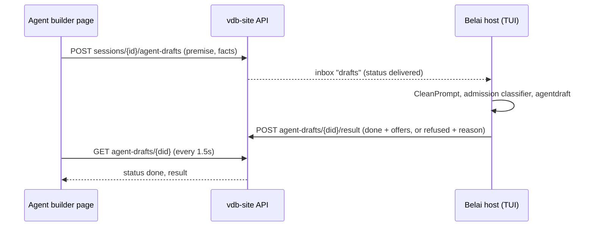

# Session sync

While Belai is logged in with the Vulnetix CLI, each session is mirrored to
the Vulnetix website. Two console pages show it:

- **Belai → History** (`/resolve/belai-history`) has three tabs. Sessions lists
  every synced session that is no longer attached to a running host. Hosts and
  Agents show the [audit log](audit.md), a separate facts-only record of what
  hosts and agents did that travels with sync but is not the session mirror.
- **Belai → Sessions** (`/resolve/belai-sessions`) lists the sessions running
  now. Opening one follows it live and accepts prompts, which run on the host
  exactly as if they had been typed there. When the host stops to ask
  something (a permission ask, a clarify question, the mode choice, a plan
  review), the page shows the question and can answer it, and the host
  carries on as if the answer had been typed there.

## The host is the source of truth

- **The mirror is the file.** The website receives the session's JSONL lines,
  each keyed by its line index (`seq`). Belai never composes an entry for the
  website: `appendEntry` writes the line to disk, then nudges the syncer, and
  the syncer tails the file.
  - Uploads are idempotent (the server ignores a `seq` it already holds).
  - A failed upload is simply re-read and re-sent.
  - A restarted host asks for the server's high-water mark and sends only what
    is missing.
  - A malformed or oversized line still takes its `seq` as a placeholder, so
    the sequence never has a hole.
  - `/tree` keeps this true. Continuing from an earlier point appends a
    `branch` line and later lines parent to the chosen entry, so the file only
    grows. The website still orders lines by `seq`; a branch appears as further
    lines until the page reads each line's `parentId`. A fork is a new session
    with its own id.
- **A web prompt is a request, not a message.** Delivery works like this:
  1. The website stores the prompt, and the host long-polls its inbox and
     claims it.
  2. The TUI admits it like a typed prompt.
  3. The TUI writes the user line with `meta.source = "web"` and
     `meta.remote_prompt_id`, then acks the request.
  4. The line reaches the website through the same tail.

  Until that line arrives, the website shows only a status chip, never a
  message bubble. Chip states: *sent*, *delivered*, *queued behind the running
  turn*, *running*, *refused* or *expired*.
- **The website renders only committed lines, in `seq` order.** A line that
  arrives past a gap triggers a refetch of the gap, not an out-of-order render.
- **A session names the agent it ran under.** The registration carries
  `activeProfile` (`belai:patcher`), read from the latest `session_meta` line
  that names one. A switch with ctrl+p appends a new `session_meta` line, so the
  syncer sees it and registers the session again, and the website shows the
  session by that agent's display name and colours. Rules and edge cases:
  - The latest line that names a profile wins (`session.LatestMeta` merges the
    same way), so ctrl+p from `belai:patcher` to `belai:verifier` moves the
    session to the second agent.
  - A line that names no profile leaves it alone. `activeProfile` is
    `omitempty`, so clearing the agent never reaches the transcript and does not
    unset it on the website; the last agent that ran stays.
  - The server keeps the stored value when a registration carries none (a host
    that predates the field, or a session that never engaged an agent), caps it
    at 128 bytes, and matches it in History search (`patcher` finds
    `belai:patcher`).
  - A worker session's first `session_meta` line carries the worker's profile
    and its name is `<profile> · <card> <title>`. For a session registered before
    the host reported `activeProfile`, the website reads the profile from that
    name prefix, and `saas` backfills the column from the synced `session_meta`
    lines.
  - The profile is a name, not a presentation. The website resolves the display
    name and colours itself (the built-in agents from a table that mirrors
    `internal/agentprofile/builtin`, a custom agent from the host's catalogue), so
    a profile with no persona is shown by its name in the console colours.
- **A web answer is a request too.** It resolves an ask only when the host
  applies it and writes the `ask_answer` line (see [Web answers](#web-answers)).

## What the session records

Besides the conversation itself, the JSONL carries the records a reader
needs to follow a turn. The website draws them; a resumed session reads the
same lines. Each is written once, by `appendEntry`, so the file and the
website never disagree.

| Type | Written when | Carries |
| --- | --- | --- |
| `session_name` | The model names the session, or a continued session inherits its parent's name (`meta.source` is `model` or `inherited`) | The name in `content`. The syncer reads it into the registration, so it is the title the website shows; the latest non-empty name wins, and an empty one never clears it |
| `session_meta` | A session starts, and whenever the mode, a plan or goal, or the engaged agent changes | `cwd`, `mode`, `resumedFrom` and `activeProfile`, each into the registration. Lines merge: a field a line omits keeps its last value (`session.LatestMeta`) |
| `turn_state` | A turn starts, and after its last rows are written | `turn_id`, `state` (`started`, `ended`, `error`, `interrupted`), `started_at`, `duration_ms` |
| `tool_start` | A main-thread tool call starts | `tool_call_id`, `tool_name`, `tool_args`, `started_at` |
| `tool` (`meta.diff`) | A tool that changed files returns | The rendered diff rows per file (`filediff.Change.Wire`), capped at 256 KiB. Every path keeps its header past the cap |
| `ask` | The host stops to ask | Entry id = ask id. `kind`: `permission` (tool, subject, args, the `rule` allow-always would add, the diff), `clarify` / `mode_choice` (the questionnaire), `plan_review` (the plan text, up to 64 KiB) |
| `ask_answer` | The ask is resolved, closed with its turn, or cancelled | Entry id = `answer-` + ask id. `source` (`host` or `web`), then `decision`, `answers`, or `plan_choice` and `notes` |
| `rolemanager` | Every role-manager or classifier decision | The existing summary and outcome, plus `verdict`, `verdict_label`, `subject` and `pass`. Decisions the live feed does not show (mode selection, goal and plan evaluation) carry `hidden: true` |
| `intel_state` | A model call moves a plan limit by a percent, or changes the pace, trend or runway word; at most once a minute | `provider`, `at`, `limits[{provider, window, used, resetsAt, observedAt}]`, `pace`, `trend`, `runway`, `roles[{role, tokens}]` (up to 8). Numbers, window names and the harness's own words only, never provider text. The website draws its limit bars and runway from the latest one |

A decision's `Detail` is never written: only the verdict token and the
harness's own structure reach the record, as with the live feed.

Resume restores diffs, rebuilds the ask and answer notices, and skips
`tool_start`, `turn_state`, `intel_state` and hidden decisions. None of these records reach
a model: the conversation is still rebuilt from paired calls and results.

## What it sends, and where

- **Content:** every line of the session JSONL, including tool calls and tool
  results (already capped at 32 KiB by the session writer).
- **Host details:**
  - The host's name, reduced to identifier characters.
  - Its OS and the Belai version.
  - A random host id kept in `~/.vulnetix/belai/sync/host-id`.
- **Destination:** requests go to `https://www.vulnetix.com/api/site/v1/belai/*`.
  - `$VULNETIX_WEB_URL` overrides the origin.
  - The credential is only sent to `https://*.vulnetix.com` or a loopback
    origin for local development.
- **Credential:** the Vulnetix CLI's own credential in the `Authorization`
  header. That is `ApiKey <org>:<hmac>` from `vulnetix auth login`, read the
  same way as the MCP `vulnetix:cli` reference and cached for five minutes.
  - An opaque API-token login (`--token`, `VULNETIX_API_TOKEN`) is not
    accepted by the console, so sync stays off with that reason.
- **Visibility:** only the principal whose credential uploaded a session can
  see or prompt it on the website.

## Web prompts

A web prompt runs through the same path as a typed prompt: the same mode
selection, the same admission gate (sanitize plus the prompt classifier under
the effective posture), the same permission rules and the same tool surface.
Beyond that:

- **Cleaned first.** `sessionsync.CleanPrompt` strips harness delimiter markup,
  terminal control sequences, other control runes and bidi overrides, and
  caps it at 32 KiB.
- **Never a local command.** A leading `/` or `!` is prompt text: the website
  cannot run a slash command, a shell command or an `@` attachment from the
  composer.
- **Never touches the composer.** A draft or pending attachment you are typing
  on the host is left alone.
- **Queued while busy.** It waits (FIFO) while a turn is running or being
  prepared, or while you are on a screen other than the transcript. It is
  acked *queued* until then.
- **Refused when it cannot run.** Two cases:
  - The session is no longer the active one on the host.
  - The host is in agent mode with no agent chosen: the agent picker is the
    host user's to answer.
- **Asks are answered through their own path.** A web prompt never answers an
  ask; a web answer does (below).
- **Refusals show in the transcript.** If admission refuses the prompt, the
  refusal is written to the transcript like any other, and the website shows
  it.

Code: `internal/sessionsync` (client, syncer, inbox, prompt cleaning),
`internal/tui/session_sync.go` (wiring, queue, `/sync`) and
`internal/tui/web_asks.go` (ask, answer, turn and decision records, and web
answers).

## Web answers

When the host stops to ask, the `ask` line reaches the website and the page
offers the same choices the host screen does:

- **Permission ask:** allow once, allow always, deny. The page shows the tool,
  its subject, the rule allow-always would add and the diff the call would
  make.
- **Clarify questions and the mode choice:** the same groups and options,
  single or multiple choice, with a note per question, skip, or decline all.
- **Plan review:** approve here, approve in a new session, refine with notes,
  or keep planning.

A web answer is untrusted input:

- **It must fit the open ask.** The host applies it only to the ask open right
  now, only if the kind matches, and only after it validates: option indices
  in range and unique, one choice for a single-choice question, a known
  decision, notes cleaned (`CleanPrompt`) and capped at 2 KiB.
- **It uses the host's own code.** The answer goes through the same functions
  as the host's keys, so every gate still applies. Clarify answers are still
  admitted by the prompt classifier on the agent side. Allow-always writes the
  same `Permissions.Allow` rule to the same settings file. Refinement notes
  take the web-prompt path, so they are never a slash or shell command.
- **The first answer wins.** Whichever of the host key or the web answer
  lands first resolves the ask and writes `ask_answer`. The server refuses a
  new answer once that line exists or another is in flight, and the host
  refuses any that still race it. The page shows the refusal and why.
- **Not everything is answerable.** The agent picker and the trust gate stay
  on the host.

Delivery mirrors web prompts: the answer is stored, the inbox hands it to the
host (answers before prompts), the host acks it *accepted* once the
`ask_answer` line is uploaded, or *refused* with a reason.

## Web agent drafts

The website's agent builder (`/resolve/belai-agent-creator`) asks a live
session to draft an agent profile from a premise. The website runs no model,
so a draft is a request like a web prompt: the host drafts with its own model
and settings and posts offers back. Nothing is written on the host. The user
takes, edits or drops each offer on the page and downloads the file for
`belai agent import`.



Rules:

- **It rides the web-prompt switch.** A premise is web-typed text, so the
  server queues a draft only for a live session with `sync.remote_prompts` on,
  and a host with it off refuses any it is handed. `sync.remote_answers` does
  not matter.
- **One at a time, and it expires.** A session has at most one draft pending
  or in progress. A draft expires 180 seconds after it was created, claimed or
  not, and when its session ends. The page gives up at 190 seconds, so the
  server's expiry is always the one the user sees. An older host that does not
  know drafts never claims one, and the page says the host may need a newer
  Belai.
- **The premise is admitted like a prompt.** The host cleans it
  (`CleanPrompt`) and runs it through the security classifier under the
  effective posture before the drafter sees it. With guardrails off the
  classifier is skipped, as for every prompt. A refused premise is never sent
  to the drafter.
- **The request carries facts only.** The context is worker profile names and
  board labels. The server keeps only identifiers (1 to 64 of
  `[A-Za-z0-9._:-]`, at most 64 workers and 128 labels) and drops anything
  else. The host checks them again. The premise is 1 to 2000 characters.
- **The drafter is a classifier turn.** `internal/agentdraft` makes a
  tool-less call on the role-manager classifier. Every value in the reply is
  checked against the profile schema, and a value that does not fit is dropped
  rather than coerced. A draft never offers `guardrails` or `ask_permission`.
  A reply without `name`, `description`, `system_prompt` and `mode` is sent
  back once with the reason (two attempts in all).
- **Crew offers come from facts.** The host computes them from the drafted
  routes and its own worker profiles and crews, never from the model. It
  offers a copy of a crew one of whose members feeds the new agent or is fed
  by it, and a gap for each label the agent sends, or that sits on the board,
  which no worker claims. It makes at most four crew offers, and none for an
  agent that is not a worker. A crew already at eight members is not offered.
- **Refusal reasons are harness text.** A refused draft carries a fixed
  sentence, such as "no classifier model is configured on this host", never
  provider or model output.
- **Cancel is final.** The page withdraws a draft when the user cancels or
  leaves the page. A host result for a cancelled or expired draft is refused
  with 409, and the host does not count that as a sync error.

The transcript notes each draft (`web: drafting an agent…`, then the field
count or the refusal). `belai agent draft PREMISE` runs the same drafter from
the command line (see [fleet.md](fleet.md)).

## Keeping it fast without blocking the TUI

The TUI never waits on the network. `appendEntry` is a local append, and
every call into the syncer is a non-blocking channel send; uploads, heartbeats
and the inbox run on the syncer's own goroutines.

- **Upload on write.** A write nudges the syncer, which waits 30 ms for the
  lines that usually follow (an ask and its notice, a tool start and its row)
  and uploads them as one batch. The 2 s tick is only a safety net.
- **Compression.** Batches over 8 KiB are gzip-encoded (diffs make lines
  large), and the server caps the decompressed size too.
- **No server polling.** Database triggers `pg_notify` on every stored line,
  prompt, answer and liveness change. Each API task holds one `LISTEN`
  connection and wakes the browser streams and host long-polls it serves, so
  a line reaches an open page, and a web answer reaches the host, in about
  one round trip. While that connection is down, the loops fall back to
  polling once a second.

## Settings

```json
{ "sync": { "enabled": true, "remote_prompts": true, "remote_answers": true } }
```

- **`sync.enabled`** — mirror sessions. Default on whenever a Vulnetix CLI
  credential resolves.
- **`sync.remote_prompts`** — accept web prompts. Default on; `false` shares
  sessions view-only.
- **`sync.remote_answers`** — accept web answers to open asks, including
  allow-always. Default on; `false` keeps every ask on the host.
- **Project layer:** a project settings file may turn any of these off, never
  on.
  The guardrails switch does not change sync; it is a data-egress setting,
  not a guardrail.

## `/sync`

- **`/sync` or `/sync status`** — shows whether sync is on, why it is off
  when it is, how many lines of this session the website holds, the last
  error, and queued web prompts.
- **`/sync off` / `/sync on`** — writes `sync.enabled` to the global settings
  and stops or starts the mirror. Stopping ends the live session on the
  website.
- **`/sync backfill`** — uploads this project's earlier sessions straight into
  History.

## Lifecycle

- **When a session appears.** The TUI creates the live session's JSONL file
  at startup, so the session is registered with the website immediately —
  before its first line. A session whose file is never created (a caller that
  does not do the startup creation) is never registered.
- **Liveness.** The host sends a heartbeat every 15 s. A session is live while
  its last heartbeat is under 45 s old, so a host that crashes drops into
  History on its own.
- **Moving to History.** Quitting the TUI, `/clear`, a resume of another
  session and `/sync off` all end the session, which moves it to History.
- **Compaction.** It starts a new session whose parent is the summarised one;
  the website links the two.
- **Headless and ACP.** `belai -prompt` and each ACP session keep a private
  transcript on disk like any other session (`-no-transcript` opts out).
  `belai -prompt` is not synced. An ACP session is: it appears on the website
  named after the editor, for example `[VS Code] explore repo`, and moves to
  History when the editor disconnects. It is upload only, so a website prompt
  or answer never reaches an editor session.
- **Remote control.** A session the website starts through `belai rc` is a
  headless session that does keep a transcript, so it syncs like a TUI
  session. It carries the dispatch id, takes web prompts and never web
  answers (see [remote-control.md](remote-control.md)).
- **One inbox per session.** Each Belai polls the host inbox for its own
  session (`?session=`), so two Belais on one machine never take each other's
  prompts.

## Server side

- **API:** `vdb-site` (`api/internal/handler/belai_*.go`) serves `/v1/belai/*`.
  - Host endpoints: host and session upsert, entry upload (gzip accepted),
    heartbeat, end, inbox long-poll (prompts, answers and agent drafts), prompt
    and answer acks, and agent-draft results.
  - Browser endpoints: list (sessions run in `/tmp`, `/private/tmp` or
    `/var/tmp` are hidden unless `tmp=1`; the live list also carries
    `openAsks`, `openAskAt` and `openAskKind`, which count ask lines with no
    `answer-<ask id>` line, so the Hosts page can show who is waiting on
    the user), detail, paged entries, an SSE
    stream, prompt create/cancel, answer create/cancel, and agent-draft
    create/read/cancel (`belai_drafts.go`).
  - Wake-ups: `belai_notify.go` listens on `belai_s` (session) and `belai_h`
    (host).
  - **Timeline** (`belai_timeline.go`, `GET /v1/belai/sessions/{id}/timeline`):
    the website's "why it did this" list, oldest first. It joins how the
    session started (from the website when it has a dispatch), each
    `turn_state` start and end, the role-manager decisions the host wrote with
    `hidden` false (their `summary` and `outcome`), `ask` and `ask_answer`
    lines (the kind, and whether the answer came from the host or the web) and
    the board cards whose history names the session. It selects no message
    `content`: only timestamps, entry types and `meta`. Every string is
    cleaned (control and bidi runes) and capped at 160 characters, a `meta`
    that is not JSON is skipped, and at most the newest 400 entry rows and 20
    cards are read. It exists on the website only; the TUI has no equivalent.
  - **Worker control** (`pause`, `resume` dispatches): the same dispatch queue
    that starts sessions and workers carries a request naming a worker id. The
    API accepts it only for a worker the host reported as live, the host
    checks the id again against its own registry, and a `paused` worker still
    counts as live (it keeps its `agents.max_workers` slot).
  - **Assignees** (`belai_assignees.go`, `POST /v1/belai/assignees`): turns an
    email into `person:<member id>` for an organization member, or
    `person:invite-<id>` for an address that is not yet a member, through the
    Members page's invitation (owners and admins only). Nothing is emailed by
    this call.
- **Schema:** it lives in `saas` (`prisma/models/belai.prisma`, migrations
  `20260926000001_add_belai_session_sync` and
  `20260928000001_add_belai_remote_answers`, which adds `BelaiRemoteAnswer`,
  `BelaiSession.remoteAnswers` and the notify triggers, and
  `20261001000001_add_belai_agent_drafts`, which adds `BelaiAgentDraft` and
  its trigger).
- **Website pages:** `src/pages/resolve/belai-*.vue`, in the sidebar's
  **Belai** group.

## Scheduled agents

A host's stored schedules ([remote-control.md](remote-control.md#scheduled-agents))
sync through the same client the way the board does, under
`/v1/belai/hosts/{id}/schedules`, and only while `belai rc` runs. The host
pulls changes after a version cursor and pushes in batches of up to 100. The
definition is last-writer-wins on its update time; the run record (last run,
status, next run) is written only by the host, and a pulled schedule never
replaces it. A text field from the website is cleaned before it is stored.

## The kanban board

The global kanban board ([kanban.md](kanban.md)) syncs through the same
client: it uses the same origin allowlist and the same credential, and it runs
only while session sync can run.

- **Pushing.** Every local change is pushed in the background.
- **Pulling.** The TUI pulls the website's changes every 15 seconds.
- **Headless and ACP.** Unlike transcripts, their kanban writes are pushed
  once as the run or connection ends.

Server side:

- **API:** the kanban routes are in `api/internal/handler/belai_kanban*.go`.
  - `GET /v1/belai/kanban/items?since=` pulls changes after a cursor.
  - `POST /v1/belai/kanban/items/batch` pushes the host's changes.
  - `PUT /v1/belai/kanban/items/{id}` and `DELETE /v1/belai/kanban/items/{id}`
    are for the browser.
- **Schema:** `BelaiKanbanItem` in `saas/prisma/models/belai.prisma`.
- **Website page:** `src/pages/resolve/belai-kanban.vue`, under **Belai →
  Kanban**.
