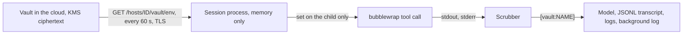

# Vault environment variables (Pix sandboxes)

Last updated: 2026-10-07

A Pix sandbox can have environment variables from the organisation's secrets vault
(the website's `/resolve/vault`). They are for the commands the agent runs, and
they are held so that the agent and the model never see a value.

Code: `internal/vaultenv` (store, scrubber, writer), `internal/sessionsync/vaultenv.go`
(the lease), hooks in `internal/tools/bash.go`, `internal/bgproc/manager.go`,
`internal/session`, and `internal/sandbox/sandbox.go`.

## What it does

- **Lease.** Every session that syncs (`sessionsync.Syncer.Start`) asks the vault for
  its host's variables each minute. The answer is held in memory for a lease of up to
  15 minutes (`leaseSeconds`). If the vault cannot be reached the variables already
  held stay until their lease ends, then none are injected.
- **Expiry and revocation.** Each variable carries `expiresAt`. It is checked on every
  call, so an expired variable is not injected even before the next renewal. A variable
  the vault no longer grants is dropped at the next renewal.
- **Injection.** Added to the command's environment after `proc.ScrubbedEnv` has removed
  the harness's credentials, so only the process a command starts holds it. Belai's own
  environment never does. The read-only Bash gate gets none. A model-started background
  command gets them like Bash.
- **Pid namespace.** While any variable is held, bubblewrap is started with
  `--unshare-pid`, so a command cannot read another process's `/proc/PID/environ`.
  Some containers mask paths under `/proc` (Cloudflare containers, so a Pix sandbox), and
  there bubblewrap cannot mount a fresh `/proc` in a new pid namespace ("Can't mount proc
  on /proc: Operation not permitted"). Belai probes this once. If the namespace cannot be
  had, it checks that a command inside the sandbox really cannot read the environment of a
  process outside it (the user namespace bubblewrap always creates normally already
  prevents that) and leaves the flag off only when the check shows it. When neither holds,
  the command is not run and the error says why; vault variables are never handed to a
  command that could read another process's environment.
- **Process hardening.** On the first lease with values the process is marked
  non-dumpable (`PR_SET_DUMPABLE 0`), so a same-user command cannot read its memory.
- **Names to the model.** The Bash tool description lists the variable names, never a
  value, and says to use `$NAME`.

## Scrubbing

`vaultenv.Store.Scrub` replaces a value with `[vault:NAME]`. It matches the value and
the forms it takes in output: base64 (standard and URL, padded and not), hex, URL
escapes, JSON escapes (with and without HTML escaping), a shell-quoted form, and each
line of a multi-line value. `vaultenv.Writer` catches a value split across writes by
holding back the last `longest form - 1` bytes.

It runs on:

| Where | Hook |
|-------|------|
| The tool result the model reads, and each streamed line | `tools.Bash.ExecuteStream` |
| A background command's log file and live tail | `bgproc` (`vaultenv.NewWriter`) |
| Every session transcript line | `session.Store.AppendTo`, `Import`, `ForkAcross`, branch copy |
| This process's stdout and stderr, when they are not a terminal | `vaultenv.Protect` |

A value is at least 8 characters (`vaultenv.MinLen`); the vault refuses a shorter one,
because it could not be scrubbed without hiding ordinary words.

After a variable expires or is revoked it is no longer injected, but its value stays in
memory in the scrubber for the life of the process, so it is still hidden if it shows up
again in output.

## Reporting

Each renewal reports how many times each variable was scrubbed from output
(`POST /hosts/ID/vault/scrub`, names and counts only). The vault's Activity tab shows
them, so a value reaching an output is visible even though it was hidden.

## What it cannot do

Scrubbing hides a value in what Belai records. It cannot stop a command from
transforming a value (a hash, a reversal, a split into pieces) or sending it to a host
the sandbox can reach. Pair a sandbox that holds secrets with deny-by-default egress.
The vault page warns when a sandbox holds variables and allows all outbound traffic.
